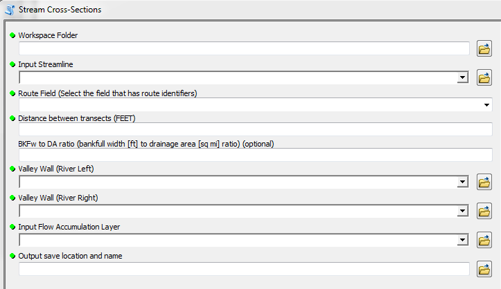
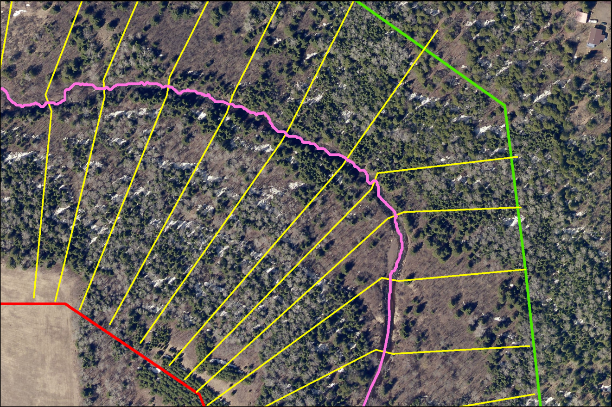
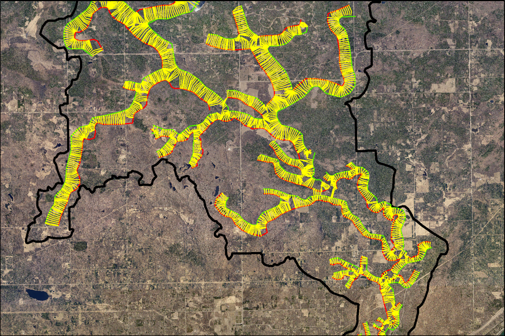

# Cross-Sections (crossSections_05262016.py)
## Synopsis

This [script] (crossSections_05262016.py) was developed to automate the process of drawing cross-sections through stream centerline using ArcGIS.  The cross-sections are perpendicular to the streamline while within the channels banks, then become perpendicular to the valley walls once out of the banks.

## Script Inputs

*For the ArcGIS script execution, the following inputs are needed:*
+ Stream centerline (route [M] enabled)
+ Optional regional curve information relating drainage area to a bankfull width
+ Digitized valley walls (left/right)
+ Flow accumulation layer (derived in previous hydrologic processing of the DEM)

This [cross-sections presentation] (CrossSectionsScript.pdf) is an overview of the script parameters and execution.

## Motivation

Previously, these cross-sections had to be manually digitized by the user in GIS, which took a while when you had a large watershed. The script I wrote significantly reduces the time to create these cross-sections throughout a watershed. Other scripts have performed a similar task, but I need my cross-sections to be perpendicular to the stream channel wihtin the channel banks, and perpendicular to the valley walls once out of the banks.

## Installation

Download the [ArcToolbox and script (.zip file)] (CrossSections.zip) to try in ArcGIS.

## Tests

This script was developed and tested with ArcGIS 10.2, Python 2.7

Python modules needed: *acrpy, math, sys, traceback*

## Contributors

Michael Harris is the author of this script.

[StackOverflow] (http://stackoverflow.com/users/4530995/michael-harris)

[LinkedIN] (https://www.linkedin.com/in/michael-harris-366b0060/)

## Acknowledgements

Some code snippets and ideas were obtained from Mark Ellefson 'Classify Stream Type' script and 'Perpendicular Transects' script by Mateus Ferreira.

## License

This code is available under the [MIT License.] (LICENSE.txt)

